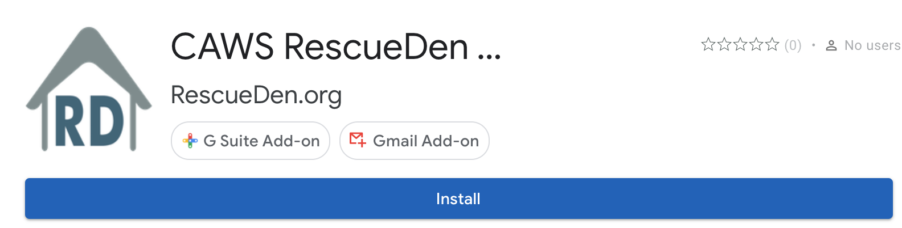
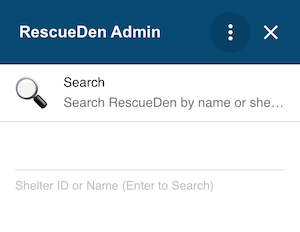
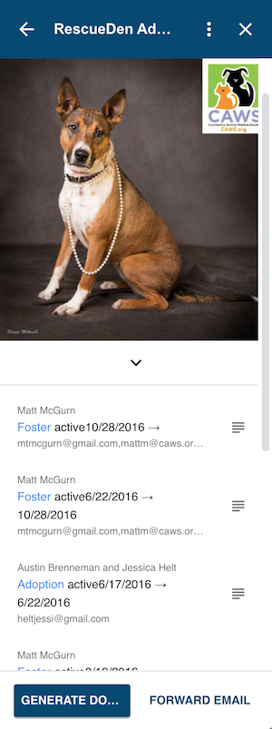
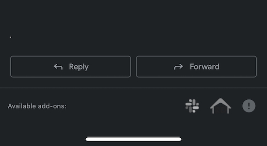
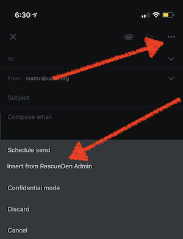

The RescueDen Admin add-on is designed to automate many of the common tasks associated with receiving and sending email.   

# Installation 
1. From a desktop computer open the [RescueDen Admin](https://gsuite.google.com/u/1/marketplace/app/caws_rescueden_admin/576875918203?hl=en&pann=gaw) page.
	* Google Chrome works best for the install and authorization.  After authorization any browser can be used.
	* Click install and follow directions.
	
2. Open GMail and select the RD icon in the Add-on Side Panel
		
3. Select your organization and follow the on screen direction to authorize Access to your RescueDen Account. A popup window may require you to review permissions and login to your RescueDen account.

# Desktop
## Opening the Add-On
In desktop GMail interface, the add-on can be activated using the RescueDen logo  on the right hand side panel.

## Homepage
The primary interface for RescueDen Admin is the homepage.  This page can be open regardless of the current message.
	

The homepage allows you to search for any animal by name or animal code.  Opening a message will cause the homepage to search for animal codes and load any found animal.

## Animal Page
Selection of an animal (either by search or automatic) reveals the primary interface of the add-on, the animal detail view.  The main components and actions that make up this view are outlined
	
* Picture: Clicking this picture will open the animal in the shelter manager software.
* Biography: Expanding the biography dropdown shows the animal current bio and if they are good with dogs, cats, children, and housetrained.
* Movement History: History of the animal movements. Clickin ghte movement type opens the movement in shelter manger software. Action buttons next to the movements includes the person in the generated email. 
* Generate Documents: This will generate documentions associated with this animal and insert them into a new email draft. [See Document Generation for more details](/support/google-add-on/document-generation).
* Logging (only avaiable from open email): Sends the open email to the shelter manager software for logging.  Users can add any comments or context.
* Foward Email (only avaiable from open email): Will foward the open email to a current or previous movement.

## Email Templates
Core volunteers often send similar emails to many people.  This is made easier using the templates built into the add-on.   When the user is composing a new email they can click on the RD Icon  to load a hieratical list of templates to go through and select.  Once selected the template is added to the document at the current text cursor. 

# Mobile
The RescueDen Add-on should be supported by GMail App on iOS and Android.

## Search & Animal Pages
The homepage is not available on mobile.  To access the search or animal pages scroll to the bottom of any email and select the RescueDen Logo. If no animal codes are in the email a search page is presented. 

## Email Templates
Email templates can be used from mobile.  When composing a new message or replying select the three dots in the upper right hand corner.  From the resulting context menu select "Insert from RescueDen Admin".  The email template selection interface will appear. 

